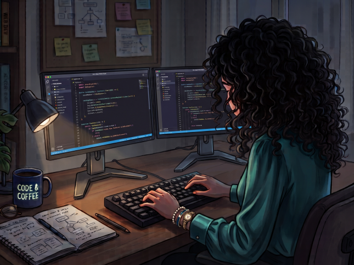

<h1 align="center"> Hi, I'm Julia  </h1>

 

  
  &nbsp;
  
  &nbsp;
  

 

## ⚡ About Me

Software Engineer based in Spain. I enjoy working on backend systems, databases, and side projects. Lately, I've been spending my free time diving into **Rust** and learning about **Data Science**.

- 🎓 **Education:** Computer Engineering graduate (UGR)
- ✈️ **Project:** Built **SkyStamp** for plane spotters
- 🛠️ **Tech:** Python, C++, SQL, Rust
- ✨ **Fun Facts:** Aviation enthusiast ✈️ | Music lover 🎶 | Gluten-Free 🌾🚫

📫 ***Open** to software engineering opportunities and side projects. Feel free to reach out if you'd like to connect or collaborate!*

 
 

<h2>🛠️ Tech Stack & Tools</h2>

 

   &nbsp;&nbsp;
   &nbsp;&nbsp;
   &nbsp;&nbsp;
   &nbsp;&nbsp;
   &nbsp;&nbsp;
   &nbsp;&nbsp;
   &nbsp;&nbsp;
   &nbsp;&nbsp;
   &nbsp;&nbsp;
   &nbsp;&nbsp;
   &nbsp;&nbsp;
   &nbsp;&nbsp;

 

<h2>📈 Coding Activity</h2>
 

  
  

